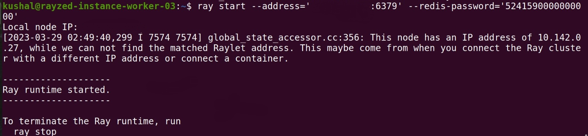
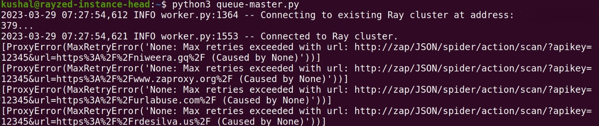

# RayZed


## Description
RayZed is a ray-based, distributed web vulnerability scanner designed on a ray queue. Moreover,
RayZed is a cloud-native application built utilising the Terraform stack.

## Abstract & Motivation
Finding out web vulnerabilities for specific targets(URLs) is a critical task. For this OWASP ZAP-ZED
helps by using its various scan functionalities like active, passive and spider scan. These scans
scrutinize the target URL for different standard vulnerabilities and thus is an extensive process. The
target(URLs) could be distributed among Ray cluster nodes deployed on the cloud-native platform
where ZAP is running as a daemon. This architecture scales the process of finding vulnerabilities for
targets. The purpose of this project is to create a parallelized tool that could fetch vulnerabilities of
different websites in an efficient way such that the process could be scaled and automated for
cybersecurity research.

## Technology stack
1. Terraform: Cloud-native platform agnostic infrastructure as code to define and manage
infrastructure
2. Ray: Parallelize the remote scan function on the cloud-native platform to cater to multiple
targets.
3. ZAP-ZED: Provide active, passive and spyder scan functionality.
4. Ansible: To automate the setup of local environments on virtual machines.
5. NGINX: For reverse proxying
6. GCP: Google Cloud Platform to provide service of the virtual machine and firewall.

## Zed Optimization Survey
[Documentation Link](https://docs.google.com/document/d/1j10LrdNFHic8l0VE-8o0wIziROTtdShs2HFSZ6Xkcog/edit?usp=sharing)

## Folder Structure
```
.
├── ansible.cfg
├── main.tf
├── misc
│   ├── ray
│   └── ray.service
├── playbook.yaml
├── queue-master.py
├── README.md
├── Scan.py
├── terraform.tfvars
├── variables.tf
└── zedzap.service

```

## Setup & Build

### Prerequisites
* GCP 
    * [Reference video](https://youtu.be/e_8LZL2Th_4)
    * [Google Cloud Platform Documentation](https://cloud.google.com/docs)
* Terraform (Version used in this project : Terraform v1.4.6
on linux_amd64
)
    * [Terraform Installation Documentation](https://developer.hashicorp.com/terraform/downloadsd)

- Ansible

### Installation

1. Clone the repository
```
git clone https://github.com/c2siorg/RayZed.git
```
### Configuration

1. Move to RayZed
```
cd RayZed
```

2. Make keys folder and store the service_account.json file fetched from GCP in this folder

```
mkdir keys

'Store the service_account.json here'
```
3. Configure terraform.tfvars file
```
Change following variables

project = 'YOUR_GCP_PROJECT_NAME'
ssh_user = "YOUR_SSH_USER_NAME"
ssh_prv_key = "YOUR_SSH_PRIVATE_KEY_PATH"
ssh_pub_key = "YOUR_SSH_PUBLIC_KEY_PATH"

(Generate rsa key pair if not existing or different for this project)
```
4. Configure .env file
```
nano .env

Change following variables

ZAP_APIKEY=YOUR_API_KEY
ZAP_PROXIES_HTTP=http://127.0.0.1:8080
ZAP_PROXIES_HTTPS=http://127.0.0.1:8080
FILEPATH=YOUR_PATH_TO_STORE_OUTPUT_ON_RAY_HEAD_NODE
TIME_OUT=60

```

### Usage

1. Terraform Commands (Builds the infrastructure and initial environment setup on the GCP VM instances)
```
terraform init
terraform plan
terraform apply
```

2. ssh commands to check the vm instances

```
ssh 'RSA_USER'@'EXTERNAL_IPADDRESS_OF_HEAD_NODE'
ssh 'RSA_USER'@'EXTERNAL_IPADDRESS_OF_WORKER_NODE'
```
3. To run ray commands once ssh established

On head node
```
ray start --head --port=6379 --include-dashboard=true
```


On worker node
```
ray start --address-'LOCAL_HEAD_NODE_IP:6379' --redis-password='52415900000000'
```


Note: If some of these commands did not run in ansible automation you could run them separately through ssh and achieve the same result.

4. To run zap service on different terminal: open zap downloaded location  and run
```
./zap.sh -daemon -config api.key=YOUR_API_KEY
```
Note: This needs to be done in case ansible automation could not run the service in all vm instances.

5. To run the queue-master.py on the head instance node. 
```
python3 queue-master.py
```


Note:
- One can edit the websites required by modifying the DATA list in queue-master.py 
- The output json files are stored in the location mentioned in the .env file in the head vm
